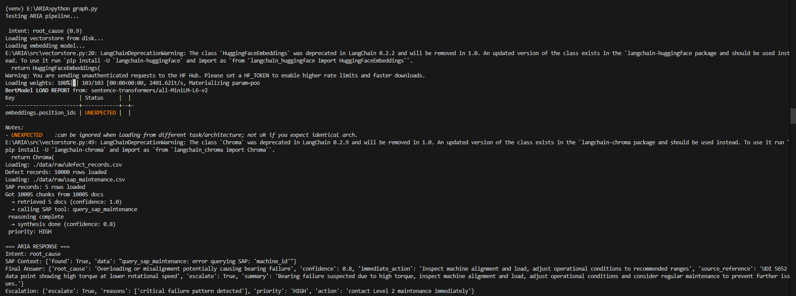

# ARIA Demo

## Query 1 — Root Cause Analysis

**Request:**
```json
{"question": "Why is machine M001 showing bearing failure with high torque?"}
```

**Response:**
```json
{
  "intent": "root_cause",
  "answer": {
    "root_cause": "Insufficient or delayed maintenance compounded by unresolved work orders",
    "confidence": 0.8,
    "immediate_action": "Prioritize resolution of open work orders and review bearing stock",
    "source_reference": "M001 SAP record + UDI 5652 data point",
    "escalate": true,
    "summary": "M001 bearing failure likely due to maintenance backlog. Immediate action required."
  },
  "escalation": {
    "escalate": true,
    "priority": "HIGH",
    "action": "contact Level 2 maintenance immediately"
  }
}
```

## Query 2 — Simple Lookup

**Request:**
```json
{"question": "What machines are currently in critical status?"}
```

**Response:**
```json
{
  "intent": "simple_lookup",
  "answer": {
    "confidence": 1.0,
    "escalate": false,
    "summary": "No critical failures detected in current records. Continue monitoring."
  },
  "escalation": {
    "priority": "NORMAL",
    "action": "schedule routine check"
  }
}
```

## Query 3 — Repair Procedure

**Request:**
```json
{"question": "How to fix tool wear failure in CNC machine?"}
```

**Response:**
```json
{
  "intent": "repair_procedure",
  "answer": {
    "root_cause": "Excessive tool wear beyond operational limits",
    "confidence": 0.8,
    "immediate_action": "Replace worn tool and inspect feed rates",
    "escalate": false,
    "summary": "Tool wear failure requires immediate replacement. Check operational parameters."
  },
  "escalation": {
    "priority": "NORMAL",
    "action": "schedule routine maintenance"
  }
}
```

## Evaluation Results

Basic eval — 3/3 passed:
- bearing failure root cause query ✓
- critical machines lookup ✓
- tool wear repair procedure ✓

RAGAs integration in place. Full scoring needs OpenAI judge LLM — 
production would use Azure OpenAI for evaluation.

## Running locally
```bash
uvicorn src.api:app --reload --port 8000
```

Swagger: `http://localhost:8000/docs`

## Pipeline Output Screenshot

